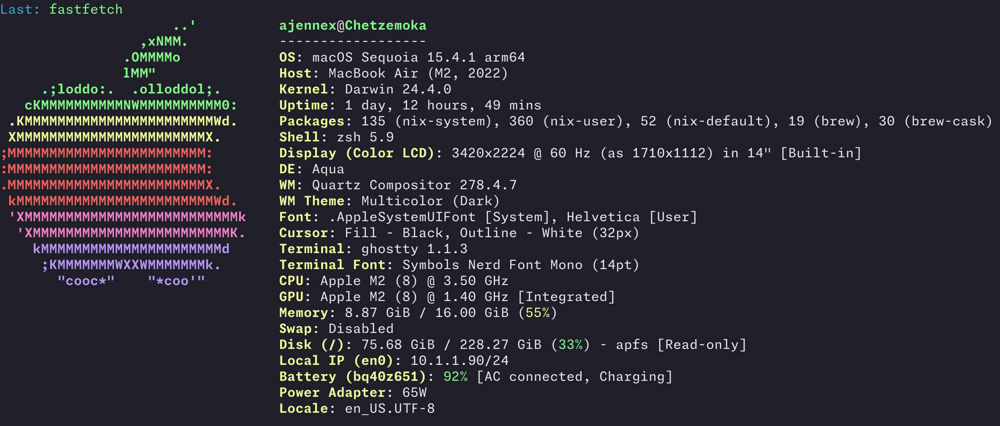

# MacBook air



## Prerequieites/Setup

* Make sure to be logged into icloud/appstore or MAS will fail to work

* Install [nix](https://nixos.org/download.html)

```shell
sh <(curl -L https://nixos.org/nix/install) --daemon
```

* Install [homebrew](https://brew.sh/)

```shell
/bin/bash -c "$(curl -fsSL https://raw.githubusercontent.com/Homebrew/install/HEAD/install.sh)"
```

Homebrew is used to install GUI packages that we don't want to install via nix becuase sometimes its hard to get spotlight to find them

## Use this flake

```shell
mkdir -p ~/src
cd ~/src
nix-shell -p git --run 'git clone https://github.com/Deatrin/dotfiles.git 
```

Install the flake

 ``` shell
  nix run nix-darwin --extra-experimental-features 'nix-command flakes' -- switch --flake .#chetzemoka
  ```

```shell
darwin-rebuild switch --flake .#chetzemoka
home-manager switch --flake .#ajennex@chetzemoka
```

## Things that need secrets

### 1Password bootstrapping auth

```shell
eval $(op signin --account <redacted>.1password.com)
```

### atuin login

```shell
atuin login --username $(op item get "atuin - THD" --vault Work --fields label=username) --password $(op item get "atuin - THD" --vault Work --fields label=password) --key "$(op item get "atuin - THD" --vault Work --fields label=key)"
atuin import auto
atuin sync
```

### kubeconfig

```shell
mkdir -p ~/.kube
op document get --vault kubernetes 'k3s.yaml' --out-file ~/.kube/config
```
